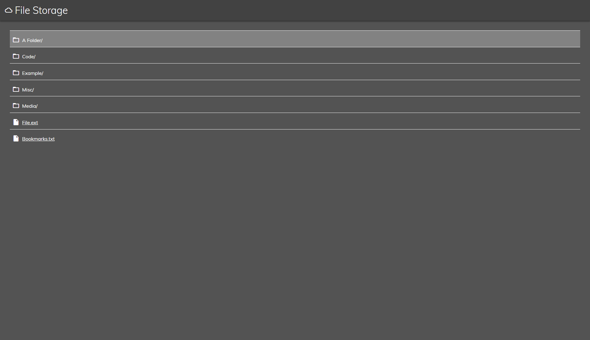
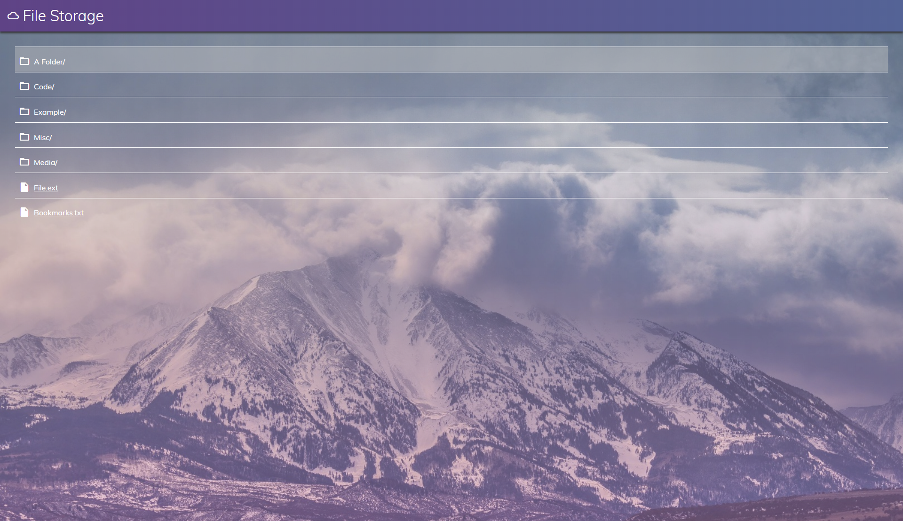

# Customizer for 'Index Of' pages
This is a web application built with JavaScript to customize 'Index Of' pages
or general file serving pages. It is built to be used with the nginx JSON setting
for Indexing.

# What's included?
* All files needed to use it
* Example config file
* 2 stylesheets to choose from

# Screenshots

*Basic style, a simple dark theme*

*Alternative style, lighther with background image and gradient*

# Setup
* nginx folder indexing in JSON format (specify link in config)
* route all requests from the folder containing index.html to the index.html

# Why?
A friend wanted a nicer Indexing page and I did this as a one-evening-project.

# Licence
Apache licence for the lolz.
